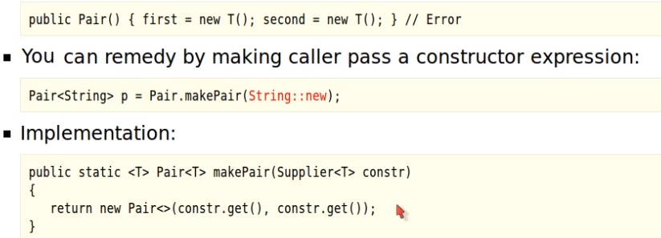

# Type parameters
- Before type parameters, Java used inheritance in ArrayList with add(Object o), get(Object o) but the problem was that 
if in an arraylist of strings, file type was added, the add method would not complain because it could add any Object there. 
But this situation will later result in a ClassCastException when file would be accessed as String. 
The problem would appear at a different place than it actually happened.
- Type parameters bring compile type safety (whereas in Object parameters, safety could only be checked at run time)


------------------------------------------------------------------------------------------------------------------

# Possible heap pollution from parameterized vararg type
  

## Heap Pollution
Heap pollution occurs when a variable of a parameterized type holds an object that is not of that type. This happens because of the way generics are implemented in Java due to type erasure. At runtime, the actual generic types are removed, so the JVM doesn't track the type parameter information for generics. If type safety is not ensured at compile-time, this can lead to runtime errors such as ClassCastException.

## How It Happens with Varargs
Varargs in Java allow you to pass a variable number of arguments to a method. Internally, varargs are converted to arrays, but arrays are covariant in Java, meaning that an array of a supertype can hold a subtype. Generics, however, are invariant.

When you use varargs with generic types, type erasure and array covariance can lead to unsafe situations.
For example, if a method accepts a varargs parameter of a generic type, Java will create an array to hold those arguments, but due to type erasure, this array will not contain type information. The result is a warning, since there is a possibility of heap pollution—where the array contains elements of a type different from the expected parameterized type.

## Summary of Key Points
1. Heap pollution can occur when using varargs with generic types, leading to potential runtime ClassCastException due to type erasure. If you mix different parameterized types like List<String> and List<Integer> in a varargs array, you could later mistakenly retrieve an Integer from a List<String>, leading to a ClassCastException.
2. Use `@SafeVarargs` if you know your method is type-safe and doesn't introduce heap pollution. This annotation is allowed on methods that do not modify the contents of the varargs array or expose it in an unsafe way.
3. Avoid varargs with generics when possible. Prefer explicitly passing collections or arrays to retain type safety.
4. Use wildcards (List<?>...) for flexibility, but be aware that you'll lose the specific type information.

# Reason for Using `extends` in Generics
  In Java, when specifying **type bounds** in generic declarations, the keyword `extends` is used for both classes and interfaces. This is a design choice by Java to simplify the generics system as this keeps the syntax consistent.
```java
public class MyClass<T extends Number & Comparable<T>> {
    // T must extend the class Number and implement Comparable<T>
}
```
------------------------------------------------------------------------------------------------------------------
# Bridge Methods
  Bridge methods in Java are a compiler-generated feature used to maintain compatibility between generic types and the type erasure mechanism used by the JVM. They help ensure that when generics are used with subclassing or method overriding, the Java runtime can still find and invoke the correct methods.

**Why Bridge Methods Are Needed:**
When Java introduced generics, it used type erasure, meaning that the type information is erased at runtime for backward compatibility. This can create a situation where a subclass overrides a method with a generic signature, but due to type erasure, the JVM can no longer distinguish between the original and the overridden method. The compiler generates a bridge method to ensure that the correct method is called at runtime.

```java
class Animal implements Comparable<Animal> {
    public int compareTo(Animal a) {
        return 0;
    }
}

class Dog extends Animal {
    @Override
    public int compareTo(Animal a) {
        return 1;
    }
}
```

```java
class Dog extends Animal {
    // The actual overridden method
    @Override
    public int compareTo(Animal a) {
        return 1;
    }

    // Bridge method generated by the compiler to override method defined in Animal
    @Override
    public int compareTo(Object o) {
        return compareTo((Animal) o); // Delegates to compareTo(Animal a)
    }
}
```


------------------------------------------------------------------------------------------------------------------
------------------------------------------------------------------------------------------------------------------

# Restrictions & Limitations of Java Generics


## Varargs warnings 
* Use `@SafeVarargs` if you know your method is type-safe and doesn't introduce heap pollution. This annotation is allowed on methods that do not modify the contents of the varargs array or expose it in an unsafe way.
* `@SafeVarargs`: In addition to the usage restrictions imposed by its `@Target({ElementType. CONSTRUCTOR,ElementType. METHOD})` meta-annotation, compilers are required to implement additional usage restrictions on this annotation type; it is a compile-time error if a method or constructor declaration is annotated with a `@SafeVarargs` annotation, and either:
  * the declaration is a fixed arity method or constructor
  * the declaration is a variable arity method that is neither `static` nor `final` nor `private`.

## Cannot instantiate a generic type



## Constructing Generic Arrays


# Generic types and Inheritance

## Inheritance and Subtype relationships


## Wildcard types


